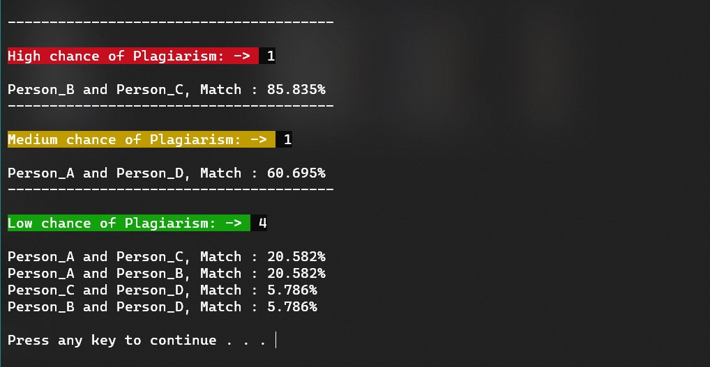

<h1>Anti-Plagiarism Tool</h1>
<p>A-Plagiarsm Tool is a simple python script which permutes over text submissions and gives the match over 3 Different levels of possible plagiarism among submissions</p>

<p></p>

### Requiremens
- Two or more text file ```.txt``` in the same directory as the python script

### Execution
<pre>python main.py</pre>

### Installation
Supported Python version : 3.x

### Python Libraries Required
- sklearn <pre>pip install -U scikit-learn</pre>
- colorama (only for colors) <pre>pip install colorama</pre>
